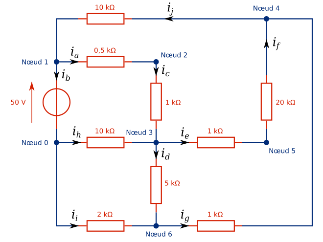

# Simulateur de circuits électriques

Thèmes: théorie des graphes, algèbre linéaire.

Les logiciels de simulation de circuits électriques permettent de déterminer les valeurs des tensions et courants dans un circuit sans avoir à faire de calculs laborieux. C'est très pratique !

**Cet exercice a pour but de vous entraîner à la manipulation de graphes et de matrices en vous guidant dans la réalisation d'un petit simulateur de circuits électriques.**

## Partie 1 : Premiers pas

Un circuit électrique est constitué de composants connectés entre eux. Tout au long de l'exercice, nous nous limiterons aux circuits comportant uniquement deux types de composants : les générateurs et les résistances. Un exemple de tel circuit est présenté ci-dessous.

Figure: Exemple de circuit électrique.

Les circuits électriques peuvent être représentés par des graphes *orientés*, dans lesquels les branches représentent les composants et les nœuds représentent les connexions entre eux. L'orientation des branches est essentielle pour déterminer le sens du courant à travers le composant : si le courant est positif, il circule dans le sens de la branche, s'il est négatif, il circule dans le sens inverse.

Figure: Graphe correspondant à l'exemple de circuit électrique.

Dans notre modèle simplifié, une branche est toujours modélisable par un générateur et une résistance en série. En jouant sur les paramètres, on peut ensuite éliminer le générateur (tension nulle) ou la résistance (résistance nulle). Une branche est ainsi représentée par la donnée d'un noeud de départ, d'un noeud d'arrivée, d'une résistance et d'une tension de générateur.

Voici quelques exemples :

* la branche $a$ est définie par le noeud de départ 1, le noeud d'arrivée 2, la résistance 0.5 kΩ, et la tension 0 V ;
* la branche $b$ est définie par le noeud de départ 1, le noeud d'arrivée 0, la résistance 0 Ω et la tension 50 V.

Dans ce formalisme, un circuit n'est rien d'autre qu'une liste de branches.
