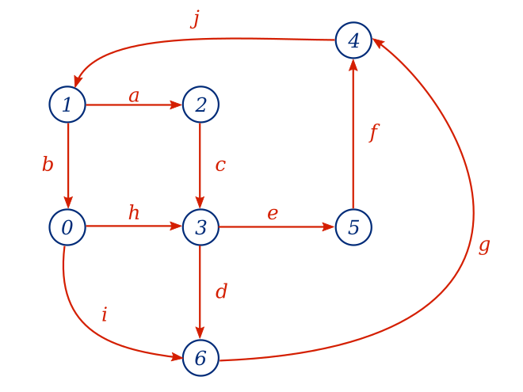
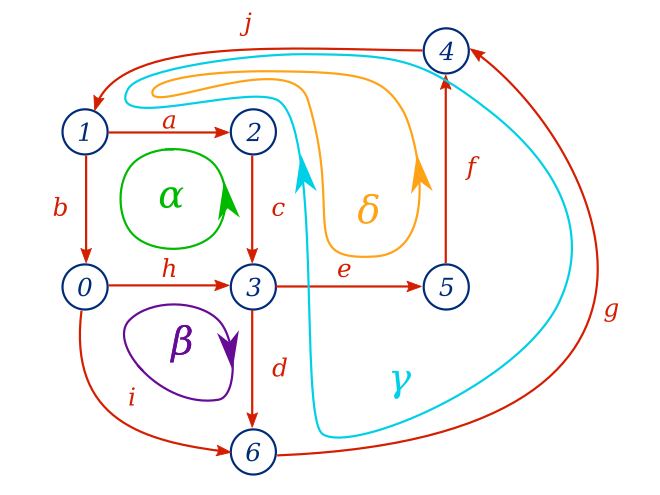
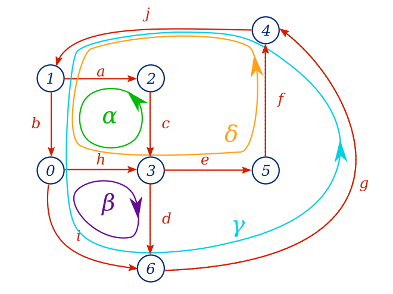

# Simulateur de circuits électriques

Thèmes: théorie des graphes, algèbre linéaire.

Les logiciels de simulation de circuits électriques permettent de déterminer les valeurs des tensions et courants dans un circuit sans avoir à faire de calculs laborieux. C'est très pratique !

**Ce problème a pour but de vous entraîner à la manipulation de graphes et de matrices en vous guidant dans la réalisation d'un petit simulateur de circuits électriques.**

## Partie 1 : Premiers pas

Un circuit électrique est constitué de composants connectés entre eux. Tout au long de l'exercice, nous nous limiterons aux circuits comportant uniquement deux types de composants : les générateurs et les résistances. Un exemple de tel circuit est présenté ci-dessous.


Les circuits électriques peuvent être représentés par des graphes *orientés*, dans lesquels les branches représentent les composants et les nœuds représentent les connexions entre eux. L'orientation des branches est essentielle pour déterminer le sens du courant à travers le composant : si le courant est positif, il circule dans le sens de la branche, s'il est négatif, il circule dans le sens inverse.



Dans notre modèle simplifié, une branche est toujours modélisable par un générateur et une résistance en série. En jouant sur les paramètres, on peut ensuite éliminer le générateur (tension nulle) ou la résistance (résistance nulle). Une branche est ainsi représentée par la donnée d'un noeud de départ, d'un noeud d'arrivée, d'une résistance et d'une tension de générateur.

Voici quelques exemples :

* la branche a est définie par le noeud de départ 1, le noeud d'arrivée 2, la résistance 0.5 kΩ, et la tension 0 V ;
* la branche b est définie par le noeud de départ 1, le noeud d'arrivée 0, la résistance 0 Ω et la tension 50 V.

Dans ce formalisme, un circuit n'est rien d'autre qu'une liste de branches ainsi définies. Dans le jargon des logiciels de simulation, on parle de *netlist*.

## Partie 2 : Manipulation de *netlists*

Les *netlists* de ce problème sont fournies sous forme de fichiers texte. Chaque ligne représente une branche et est constituée du noeud de départ, du noeud d'arrivée, de la tension et de la résistance, séparés par des  points-virgules. Les noeuds de départ et d'arrivée sont des entiers. Les tensions et les résistances sont des nombres à virgule. La structure de chaque ligne est donc la suivante :

```
<no_noeud_départ>; <no_noeud_arrivée>; <tension>; <résistance>
...
```

À titre d'exemple, voici la *netlist* du circuit de la partie 1.

```
1;2;0;500
1;0;50;0
2;3;0;1000
3;6;0;5000
3;5;0;1000
4;5;0;20000
6;4;0;1000
0;3;0;10000
0;6;0;2000
4;1;0;10000
```

**Exercice (facile) :** Écrire un programme qui lit une *netlist* et donne :

* le nombre de branches,
* le nombre de générateurs (tension non nulle),
* le nombre de résistances (résistance non nulle),
* le nombre de nœuds.

## Partie 3 : Matrice d'incidence et matrice d'incidence réduite

Bien qu'une *netlist* soit une description complète d'un circuit électrique, elle ne nous sera pas très utile telle quelle pour déterminer les courants et tensions dans le circuit. Nous aurons notamment besoin d'une *matrice d'incidence*. Pour un circuit comportant N nœuds et B branches, cette matrice comporte N lignes et B colonnes : chaque ligne correspond donc à un nœud et chaque colonne à une branche. Le coefficient de la ligne n et de la conne b vaut :

* +1, si la branche b arrive sur le nœud n,
* -1, si la branche b part du nœud n,
*  0, si la branche b n'arrive ni part du nœud n.

Une matrice d'incidence contient toute la topologie du graphe, c'est-à-dire la manière dont sont connectées les branches, sans s'intéresser aux composants. Elle peut être utilisée pour écrire les lois des nœuds du circuit, qui font partie des équations nécessaires à sa résolution ; nous en reparlerons plus loin.

La matrice d'incidence du circuit de la partie 1 est montrée ci-dessous.

```
           a    b    c    d    e    f    g    h    i    j
		  
Noeud 0    0   +1    0    0    0    0    0   -1   -1    0
Noeud 1   -1   -1    0    0    0    0    0    0    0   +1
Noeud 2   +1    0   -1    0    0    0    0    0    0    0
Noeud 3    0    0   +1   -1   -1    0    0   +1    0    0
Noeud 4    0    0    0    0    0   -1   +1    0    0   -1
Noeud 5    0    0    0    0   +1   +1    0    0    0    0
Noeud 6    0    0    0   +1    0    0   -1    0   +1    0
```

**Exercice (facile) :** Écrire un programme lisant une *netlist* et donnant la matrice d'incidence correspondante.

Dans la suite du problème, nous aurons besoin de calculer des *matrices d'incidence réduites*. Pour une matrice d'incidence et un nœud donné, on obtient la matrice d'incidence réduite associée en enlevant la ligne correspondant à ce nœud, tout simplement.

La matrice d'incidence réduite est liée à la notion de référence de potentiel du circuit électrique : le nœud retiré de la matrice d'incidence correspondra à la masse.

Voici la matrice d'incidence réduite du circuit d'exemple pour le nœud 0.

```
           a    b    c    d    e    f    g    h    i    j
		  
Noeud 1   -1   -1    0    0    0    0    0    0    0   +1
Noeud 2   +1    0   -1    0    0    0    0    0    0    0
Noeud 3    0    0   +1   -1   -1    0    0   +1    0    0
Noeud 4    0    0    0    0    0   -1   +1    0    0   -1
Noeud 5    0    0    0    0   +1   +1    0    0    0    0
Noeud 6    0    0    0   +1    0    0   -1    0   +1    0
```

**Exercice (facile) :** Écrire un programme prenant pour argument une matrice d'incidence et un nœud et retournant la matrice d'incidence réduite correspondante.

## Partie 4 : Matrices de mailles et mailles indépendantes

En plus de la matrice d'incidence, nous aurons besoin d'une *matrice de mailles indépendantes* pour la résolution du circuit. Avant de parler de matrices cependant, il nous faut parler de mailles et surtout de mailles indépendantes.

Dans un circuit électrique, une maille est une boucle orientée qui part d'un noeud et revient sur ce même nœud sans passer deux fois par la même branche. Cette notion est analogue à la notion de cycle élémentaire de la théorie des graphes. Ainsi, trouver une maille dans un circuit est équivalent à trouver un cycle élémentaire dans le graphe du circuit.

La figure ci-dessous montre différentes mailles du circuit d'exemple.



Une maille peut par exemple être représentée par une liste de branches, formant un sous-ensemble des branches du circuit complet.

**Exercice (moyen) :** Écrire un programme qui détermine si une liste de branche forme une maille d'un circuit donné. Le circuit et la branche peuvent par exemple être donnés sous forme de *netlist*.

Une représentation des mailles plus utile pour le calcul qu'une simple liste est ce qu'on appelle *une matrice de mailles*, car elle permet d'écrire les lois des mailles du circuit, qui font partie des lois fondamentales des circuits électriques. Une matrice de maille est consistuée de M lignes, qui représentent autant de mailles, et de B colonnes, B étant le nombre total de branche du circuit. Pour une maille α et une branche b, le coefficient à la ligne et la colonne correspondantes vaudra :

*  0 si la maille ne contient pas la branche,
* +1 si la maille suit la branche dans le même sens,
* -1 si la maille suit la branche dans le sens opposé.

Voici un exemple de matrice de mailles pour le circuit d'exemple, à partir des mailles montrée dans la figure vue plus tôt.


```
            a    b    c    d    e    f    g    h    i    j
		  
Maille α   -1   +1   -1    0    0    0    0   +1    0    0
Maille β    0    0    0   +1    0    0    0   +1   -1    0
Maille γ   -1    0   -1   -1    0    0   -1    0    0   -1
Maille δ   +1    0   +1    0   +1   -1    0    0    0   +1

```

Aucune des mailles de la matrice ci-dessus ne peuvent pas être obtenues par combinaison linéaire des autres mailles : on dit que les mailles sont indépendantes.

**Exercice (moyen) :** Écrire un programme qui, à partir d'une matrice de mailles donnée, indique s'il s'agit de mailles indépendantes ou non.

Pour déterminer tous les courants et toutes les tensions dans le circuit, il nous faudra suffisamment d'équations indépendantes, dont une partie seront des lois des mailles. Ainsi, il est important de trouver un système de mailles indépendantes tel qu'il ne soit pas possible d'ajouter de mailles sans que les mailles du système deviennent dépendantes.

Il est possible de montrer que dans un circuit avec N nœuds et B branches, un système de mailles indépendantes aura au plus B - N + 1 mailles, qu'il est possible de trouver de manière systématique à l'aide d'un algorithme qui travaille sur le graphe du circuit.

Cet algorithme est le suivant :

* choisir un nœud arbitrairement dans le graphe du circuit ;
* effectuer un parcours en profondeur du graphe afin de construire un *arbre couvrant* (c'est-à-dire un arbre contenant tous les nœuds du graphe) ;
* prendre une branche qui n'est pas dans l'arbre (un *chaînon*)  et l'ajouter à l'arbre couvrant, puis identifier la maille ainsi créée ;
* recommencer pour tous les autres chaînons afin d'identifier toutes les mailles.



**Exercice (difficile) :** Écrire un programme qui, à partir d'une matrice d'incidence donnée, construit une matrice de B - N + 1 mailles indépendantes.

